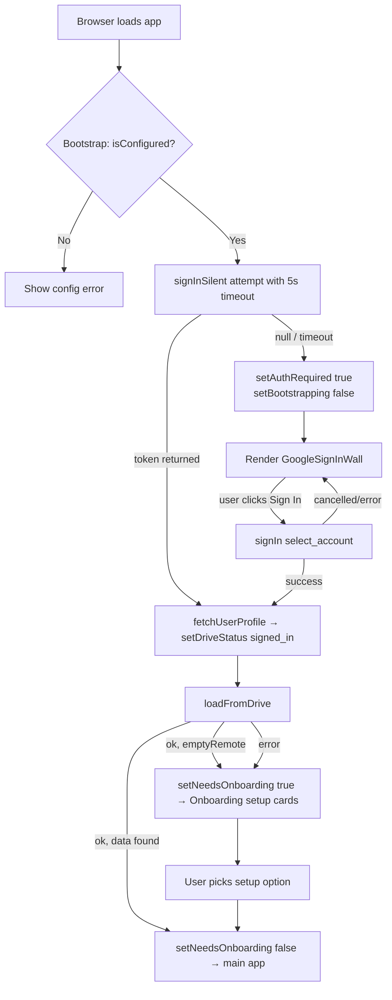
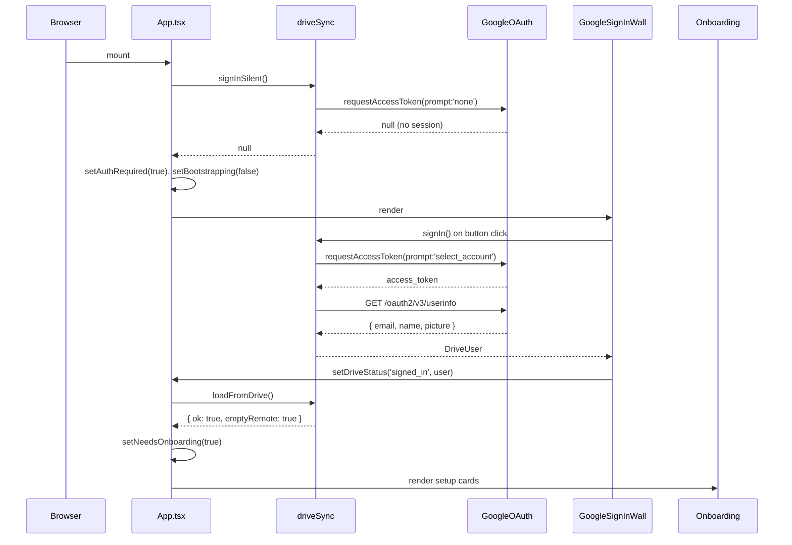
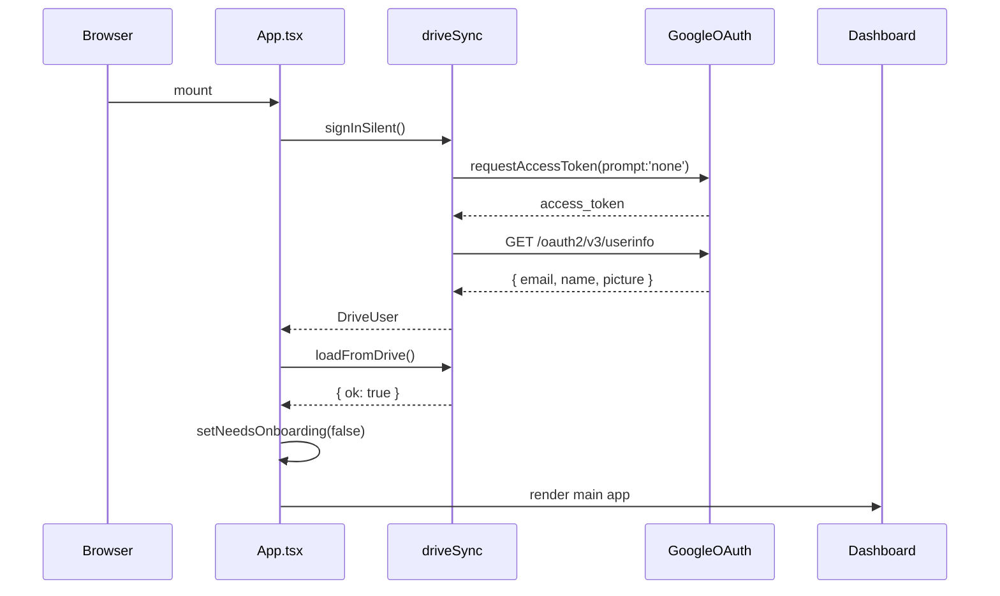

# Design Document: Mandatory Google Sign-In

## Overview

This feature makes Google Sign-In a hard prerequisite before any part of the personal finance app is accessible. Currently the onboarding screen presents four parallel options (Continue with Google, Use sample template, Import from Excel, Start from scratch), allowing users to bypass authentication entirely. After this change, the app will always require a successful Google OAuth token before rendering any content — including the onboarding setup cards. Once authenticated, the existing setup paths (sample template, Excel import, start from scratch) remain available, but they are gated behind the sign-in wall.

The change is intentionally minimal in scope: no new backend, no new storage, no new OAuth scopes. The existing `driveSync.ts` token-client flow, `useAppStore.ts` state, and `App.tsx` bootstrap are extended rather than replaced. The primary behavioral difference is that `needsOnboarding` and the main app routes are both unreachable until `driveStatus === 'signed_in'`.

---

## Architecture



---

## Sequence Diagrams

### First-time user (no prior session)



### Returning user (valid silent token)



---

## Components and Interfaces

### GoogleSignInWall

**Purpose**: Full-screen gate rendered whenever `authRequired === true`. Replaces the inline sign-in callout that previously lived inside `Onboarding.tsx`. Owns the interactive sign-in button and all error/loading states for the auth flow.

**Interface**:
```typescript
// No props — reads auth state from useAppUI, dispatches via driveSync
function GoogleSignInWall(): JSX.Element
```

**Responsibilities**:
- Display app branding and a single "Continue with Google" button
- Call `signIn()` on click; update store on success via `setDriveStatus`
- Show inline error message on failure (non-cancellation errors only)
- Show loading spinner while sign-in is in flight
- Never expose any app data or navigation links

---

### Onboarding (modified)

**Purpose**: Setup wizard shown after authentication when the user's Drive is empty. The Google sign-in callout block is removed entirely; the component can assume `driveStatus === 'signed_in'` is always true when it renders.

**Interface**:
```typescript
// Unchanged external interface — still a route-level component
function Onboarding(): JSX.Element
```

**Responsibilities**:
- Present the three setup paths: sample template, Excel import, start from scratch
- Push data to Drive after each setup action (unchanged)
- No longer responsible for triggering or rendering Google sign-in

---

### App.tsx (modified bootstrap)

**Purpose**: Orchestrates the auth-then-data bootstrap sequence. Adds `authRequired` state and the `GoogleSignInWall` render branch.

**Interface**:
```typescript
// useBootstrap hook — internal to App.tsx
function useBootstrap(): void

// Auth gate component — internal to App.tsx
function AuthGate(): JSX.Element | null
```

**Responsibilities**:
- On mount: attempt silent sign-in; if it fails, set `authRequired = true` and stop bootstrapping
- On silent sign-in success: load Drive data, then determine `needsOnboarding`
- Render `<GoogleSignInWall>` when `authRequired === true`
- After `GoogleSignInWall` completes sign-in, resume the Drive load + onboarding check

---

### useAppUI store (modified)

**Purpose**: Adds `authRequired` boolean to track whether the sign-in wall should be shown.

**Interface**:
```typescript
interface AppUIState {
  // existing fields unchanged ...
  authRequired: boolean
  setAuthRequired: (v: boolean) => void
}
```

---

## Data Models

### AppUIState (extended)

```typescript
interface AppUIState {
  isBootstrapping: boolean
  needsOnboarding: boolean
  authRequired: boolean          // NEW — true when sign-in wall must be shown
  driveStatus: DriveStatus
  driveUser: DriveUser | null
  lastSyncedAt: number | null
  lastEditedAt: number | null
  toast: { message: string; kind: 'info' | 'success' | 'error' } | null

  setBootstrapping: (v: boolean) => void
  setNeedsOnboarding: (v: boolean) => void
  setAuthRequired: (v: boolean) => void  // NEW
  setDriveStatus: (s: DriveStatus, user?: DriveUser | null) => void
  markSynced: () => void
  markEdited: () => void
  showToast: (message: string, kind?: 'info' | 'success' | 'error') => void
  clearToast: () => void
}
```

**Validation Rules**:
- `authRequired` and `isBootstrapping` are mutually exclusive in steady state: once bootstrapping ends, exactly one of `authRequired === true` (wall shown) or `authRequired === false` (app accessible) is true
- `authRequired` must be set to `false` before `needsOnboarding` or any main route is evaluated

---

## Algorithmic Pseudocode

### Bootstrap sequence (revised)

```typescript
async function bootstrap(): Promise<void> {
  // Precondition: isConfigured() === true (CLIENT_ID is set)
  // Postcondition: either authRequired=true (wall shown) or
  //                needsOnboarding reflects DB state and app is accessible

  try {
    const silentPromise = signInSilent()
    const timeoutPromise = new Promise<null>(resolve => setTimeout(() => resolve(null), 5000))
    const user = await Promise.race([silentPromise, timeoutPromise])

    if (user) {
      // Silent sign-in succeeded — proceed to data load
      setDriveStatus('signed_in', user)
      const result = await loadFromDrive()
      if (result.ok) markSynced()

      const first = await isFirstLaunch()
      setNeedsOnboarding(first)
      setAuthRequired(false)
    } else {
      // No active session — show the sign-in wall
      setAuthRequired(true)
    }

    registerDbWriteHooks()
  } catch (err) {
    console.error('Bootstrap error:', err)
    setAuthRequired(true)  // fail-safe: require sign-in on any unexpected error
  } finally {
    setBootstrapping(false)
  }
}
```

**Preconditions:**
- `isConfigured()` returns `true` (VITE_GOOGLE_OAUTH_CLIENT_ID is set)
- GIS script is loadable from `accounts.google.com`

**Postconditions:**
- `isBootstrapping` is `false`
- If `user !== null`: `driveStatus === 'signed_in'`, `authRequired === false`, `needsOnboarding` reflects DB state
- If `user === null`: `authRequired === true`, `needsOnboarding` is irrelevant (wall is shown)

**Loop Invariants:** N/A (no loops)

---

### Post-sign-in continuation

```typescript
async function handleSignInSuccess(user: DriveUser): Promise<void> {
  // Called by GoogleSignInWall after signIn() resolves
  // Precondition: user is a valid DriveUser with non-empty email
  // Postcondition: authRequired=false, needsOnboarding reflects Drive/DB state

  setDriveStatus('signed_in', user)
  setAuthRequired(false)

  const result = await loadFromDrive()
  if (result.ok && !result.emptyRemote) {
    markSynced()
    setNeedsOnboarding(false)
    showToast(`Welcome back, ${user.name}. Loaded data from Drive.`, 'success')
  } else {
    // New account or empty Drive — go to setup
    await db.meta.put({ key: 'wiped', value: true })
    setNeedsOnboarding(true)
    showToast(`Signed in as ${user.email}. Choose how to set up your data.`, 'info')
  }
}
```

**Preconditions:**
- `user.email` is non-empty
- `driveSync.signIn()` has already resolved successfully (token is held in module scope)

**Postconditions:**
- `authRequired === false`
- `driveStatus === 'signed_in'`
- `needsOnboarding` is `true` if Drive was empty, `false` if data was loaded

---

## Key Functions with Formal Specifications

### `useBootstrap` (App.tsx)

```typescript
function useBootstrap(): void
```

**Preconditions:**
- Called exactly once per page load (module-level `bootstrapStarted` guard enforces this)
- `isConfigured()` is `true`

**Postconditions:**
- `isBootstrapping` transitions from `true` → `false` exactly once, in the `finally` block
- If silent sign-in succeeds: `authRequired === false`, `driveStatus === 'signed_in'`
- If silent sign-in fails or times out: `authRequired === true`
- DB write hooks are registered exactly once

---

### `GoogleSignInWall` (new component)

```typescript
function GoogleSignInWall(): JSX.Element
```

**Preconditions:**
- Rendered only when `authRequired === true && !isBootstrapping`
- `isConfigured()` is `true` (component should not render otherwise)

**Postconditions:**
- On successful sign-in: calls `handleSignInSuccess(user)`, which sets `authRequired = false`
- On cancelled sign-in: remains visible, no state change
- On failed sign-in: shows inline error, remains visible

---

### `AuthGate` (App.tsx internal)

```typescript
function AuthGate(): JSX.Element | null
```

**Preconditions:**
- Rendered after bootstrap completes (`isBootstrapping === false`)

**Postconditions:**
- Returns `<GoogleSignInWall>` when `authRequired === true`
- Returns `null` when `authRequired === false` (normal app renders)

---

## Example Usage

```typescript
// App.tsx render tree after this change:

export default function App() {
  useBootstrap()
  const isBootstrapping = useAppUI(s => s.isBootstrapping)
  const authRequired = useAppUI(s => s.authRequired)

  if (isBootstrapping) {
    return <LoadingScreen />
  }

  if (authRequired) {
    return <GoogleSignInWall onSuccess={handleSignInSuccess} />
  }

  return (
    <>
      <OnboardingGate />
      <Routes>
        <Route path="/onboarding" element={<Onboarding />} />
        <Route element={<Layout />}>
          <Route path="/" element={<Dashboard />} />
          {/* ... other routes ... */}
        </Route>
      </Routes>
    </>
  )
}
```

```typescript
// GoogleSignInWall.tsx — minimal shape

export function GoogleSignInWall({ onSuccess }: { onSuccess: (user: DriveUser) => void }) {
  const [signingIn, setSigningIn] = useState(false)
  const [error, setError] = useState<string | null>(null)

  async function handleClick() {
    setSigningIn(true)
    setError(null)
    try {
      const user = await signIn()
      onSuccess(user)
    } catch (err: any) {
      if (!/cancelled/i.test(String(err?.message))) {
        setError(err?.message ?? 'Sign-in failed')
      }
    } finally {
      setSigningIn(false)
    }
  }

  return (
    <div className="h-full grid place-items-center bg-ink-900 text-ink-50">
      <div className="text-center max-w-sm px-6">
        <h1 className="text-2xl font-semibold mb-2">Finance</h1>
        <p className="text-sm text-ink-300 mb-6">
          Sign in with Google to access your data. Your finances sync to a
          single JSON file in your own Google Drive.
        </p>
        <button className="btn-primary w-full" disabled={signingIn} onClick={handleClick}>
          {signingIn ? 'Signing in…' : 'Continue with Google'}
        </button>
        {error && <p className="text-xs text-red-400 mt-3">{error}</p>}
      </div>
    </div>
  )
}
```

---

## Correctness Properties

*A property is a characteristic or behavior that should hold true across all valid executions of a system — essentially, a formal statement about what the system should do. Properties serve as the bridge between human-readable specifications and machine-verifiable correctness guarantees.*

### Property 1: Auth wall exclusivity

*For any* bootstrap outcome, when `isBootstrapping === false`, the rendered output contains the `GoogleSignInWall` if and only if `authRequired === true`; no route component (Dashboard, Onboarding, Accounts, etc.) is mounted while `authRequired === true`.

**Validates: Requirements 1.1, 1.2, 1.3**

### Property 2: authRequired false implies signed in

*For any* app state where `isBootstrapping === false`, if `authRequired === false` then `driveStatus === 'signed_in'`.

**Validates: Requirements 1.4, 5.5**

### Property 3: Silent sign-in success produces correct state

*For any* valid `DriveUser` returned by `signInSilent`, after bootstrap completes, `driveStatus === 'signed_in'` and `authRequired === false`.

**Validates: Requirements 2.2**

### Property 4: Non-success bootstrap always sets authRequired true

*For any* bootstrap execution where `signInSilent` returns `null`, times out, or throws an error, after bootstrap completes, `authRequired === true`.

**Validates: Requirements 2.3, 2.5**

### Property 5: Bootstrap always completes

*For any* combination of `signInSilent` result (success, null, timeout, error) and `loadFromDrive` result, after the bootstrap sequence runs, `isBootstrapping === false`.

**Validates: Requirements 2.6**

### Property 6: Sign-in wall never exposes financial data

*For any* app state where `GoogleSignInWall` is rendered, the rendered output contains no financial data, account information, navigation links, or route-level content.

**Validates: Requirements 4.2**

### Property 7: Interactive sign-in success triggers state update

*For any* valid `DriveUser` returned by `signIn()`, the `GoogleSignInWall` calls `setDriveStatus('signed_in', user)` with that user before any further navigation or state evaluation.

**Validates: Requirements 4.4**

### Property 8: Cancellation errors are silently swallowed

*For any* error thrown by `signIn()` whose message matches `/cancelled/i`, the `GoogleSignInWall` displays no error message and remains visible with the button re-enabled.

**Validates: Requirements 4.5**

### Property 9: Non-cancellation errors are displayed

*For any* error thrown by `signIn()` whose message does not match `/cancelled/i`, the `GoogleSignInWall` displays the error message inline.

**Validates: Requirements 4.6**

### Property 10: Drive load outcome determines needsOnboarding

*For any* `DriveUser` and any `loadFromDrive` result, after the post-sign-in continuation runs: if `result.ok && !result.emptyRemote` then `needsOnboarding === false`; otherwise `needsOnboarding === true`.

**Validates: Requirements 5.2, 5.3, 5.4**

### Property 11: DB write hooks trigger auto-save

*For any* database write event on any of the registered tables, both `markEdited()` and `scheduleAutoSave()` are called.

**Validates: Requirements 8.2**

---

## Error Handling

### Scenario 1: Silent sign-in times out (5s)

**Condition**: `signInSilent()` hangs — GIS script loads but `requestAccessToken(prompt:'none')` never calls back within 5 seconds.  
**Response**: `Promise.race` resolves with `null`; bootstrap sets `authRequired = true` and finishes.  
**Recovery**: User sees the sign-in wall and can trigger an interactive sign-in.

### Scenario 2: Interactive sign-in cancelled

**Condition**: User closes the Google OAuth popup without completing sign-in.  
**Response**: `signIn()` throws with a message matching `/cancelled/i`; `GoogleSignInWall` swallows the error and stays visible.  
**Recovery**: Button remains enabled; user can try again.

### Scenario 3: Interactive sign-in fails (network/OAuth error)

**Condition**: `signIn()` throws a non-cancellation error.  
**Response**: `GoogleSignInWall` sets `error` state and displays the message inline.  
**Recovery**: User can retry; error clears on next attempt.

### Scenario 4: `loadFromDrive` fails after sign-in

**Condition**: Token is valid but Drive API returns an error (quota, permissions, network).  
**Response**: `handleSignInSuccess` receives `result.ok === false`; treats it the same as `emptyRemote` — routes user to onboarding setup cards with a toast.  
**Recovery**: User can set up data locally; auto-save will retry Drive on next write.

### Scenario 5: `VITE_GOOGLE_OAUTH_CLIENT_ID` not set

**Condition**: `isConfigured()` returns `false`.  
**Response**: Bootstrap skips the silent sign-in attempt entirely. Since auth is now mandatory, the app should render a configuration error screen rather than the sign-in wall (which would be non-functional).  
**Recovery**: Developer sets the env var and rebuilds.

---

## Testing Strategy

### Unit Testing Approach

- Test `useBootstrap` hook in isolation using `renderHook` + mocked `driveSync` module
- Assert that `authRequired = true` when `signInSilent` returns `null`
- Assert that `authRequired = false` and `driveStatus = 'signed_in'` when `signInSilent` returns a user
- Assert that `isBootstrapping` is always `false` after the hook settles (including error paths)
- Test `GoogleSignInWall` renders the sign-in button and shows error text on failure

### Property-Based Testing Approach

**Property Test Library**: fast-check

- **Property**: For any combination of `(silentResult: DriveUser | null, driveLoadResult: LoadResult)`, after bootstrap completes, `isBootstrapping === false` always holds.
- **Property**: `authRequired === true` if and only if `silentResult === null` (or bootstrap threw).
- **Property**: `needsOnboarding` is only ever set when `authRequired === false`.

### Integration Testing Approach

- Mount `<App>` with a mocked `driveSync` module; verify that no route component renders until `authRequired` transitions to `false`
- Simulate the full sign-in wall → interactive sign-in → Drive load → onboarding flow end-to-end
- Verify that navigating directly to `/` or `/payday` while `authRequired === true` still shows the sign-in wall (not a redirect to `/onboarding`)

---

## Performance Considerations

- The GIS script (`accounts.google.com/gsi/client`) is already lazy-loaded on first sign-in attempt via `initGsi()`. No change needed.
- The 5-second silent sign-in timeout is preserved from the existing bootstrap. This bounds the "Loading…" screen duration for users without an active Google session.
- `GoogleSignInWall` is a trivial component with no data fetching; it adds negligible render cost.

---

## Security Considerations

- **No data before auth**: By gating all routes behind `authRequired`, no financial data is ever rendered to an unauthenticated browser session.
- **Token scope unchanged**: The existing `drive.file` + `userinfo` scopes are sufficient; no additional OAuth scopes are needed.
- **Silent sign-in uses `prompt:'none'`**: This never shows a UI prompt and only succeeds if the user has an active Google session, preventing silent token acquisition without user consent.
- **No token storage**: Access tokens remain in the `driveSync` module's closure (memory only); they are never written to `localStorage` or `sessionStorage`.
- **Referrer policy on avatar images**: The existing `referrerPolicy="no-referrer"` on profile picture `` tags is preserved.

---

## Dependencies

| Dependency | Purpose | Change |
|---|---|---|
| `@google/identity-services` (GIS, loaded via CDN) | OAuth token-client flow | No change |
| `VITE_GOOGLE_OAUTH_CLIENT_ID` env var | OAuth client ID | Now required (was optional) |
| `driveSync.ts` | `signIn`, `signInSilent`, `loadFromDrive` | No API changes |
| `useAppStore.ts` | App UI state | Add `authRequired` + `setAuthRequired` |
| `App.tsx` | Bootstrap + routing | Add `authRequired` branch |
| `Onboarding.tsx` | Setup wizard | Remove sign-in callout block |
| New: `GoogleSignInWall.tsx` | Full-screen auth gate | New component |
